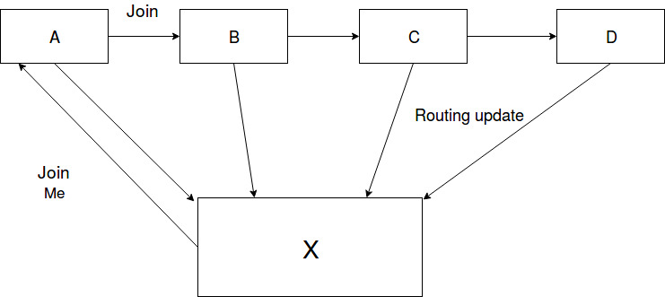

# Pastry
==========

## Node Structure:
1. IPv4(String)
2. Port(String)
3. Node ID(String): md5 hash value of IP+Port
4. Proximity(Int): Ping Time for this node
5. Leaf Set(Pair<Set,Set>):  Set of Nodes closest to the current node in terms of NodeID
6. Routing Table(vector<vector>): Nodes in the ith row have i length prefix match with the current NodeID
7. Neighbourhood Set(Set): Set of Nodes closest to the current node in terms of Proximity
8. HashTable: To store Key, Value pairs locally

## Key Classes:
1. Database: Singleton object to store all the Node relevant data like Routing tables, etc (contains locks for mutual exclusion)
2. LogHandler: Singleton object to write to Log Files (LogError/LogMsg)
3. Printer: Print Output/Error to console
4. Network Interface: Interface between application and network(Write to/Read From network)

## Message Types:
Used Protocol Buffers for message serialization and de-serialization

1. JoinMe: Sent when a new node joins a network
2. Join: Routed through the network while a new node joins
3. RoutingUpdate: Updates sent by other nodes while joining the network
4. AllStateUpdate: Update sent to all the nodes in the routing tables
5. AddToHashTable: To add relevant key, value pairs to the Node
6. SetValue: Store Key Value pair
7. GetValue: Get Value of the given key
8. DeleteNode: Delete the node entry from the routing tables
9. Shutdown: Shutdown the pastry network

## Routing Algorithm:
Route ( Destination node):
1. Check if the destination node is within the range of the leafsets.
2. If yes then we can reach the destination in one hop.
3. Suppose ‘p’ is the length of the matched prefix between destination node and current node.  Also let ‘i’ be the pth value in destination node id.
4. Check if, entry for pth row and ith column is not NULL.
5. If it is not NULL then route to it. Check in the union of routing table, leaf set and neighbour set. Choose the most suitable node. Then route to it. 

## Routing Updates

## Repair Algorithm:

### Leaf set Repair:
1. For Left Leaf set, we will ask for the leaf entries from the leftmost leaf. If we will find an entry that’s NodeId is less than ours. We will insert it in left leaf set.
2. If no relevant entry is found. Then the same procedure is repeated with the next node from the previously selected node.
3. For Right Leaf set same procedure is followed except that rightmost leaf is called first.

### Neighbour set Repair:
1. We will ask for the neighbour set from the last neighbour of ours. If we find a new entry than we will insert it in neighbour set. Otherwise, We will repeat the same procedure with the next node from the previously selected node.

### Routing Table Update:
1. Suppose R[p][i] is the entry which is needed to be repaired. The algorithm will ask for the R[p][i] entries from nodes R[p][j] for all j!=i.
2. If no relevant entries are found than it will ask from next row and follows the same procedure until a relevant entry is found

## Key Features:
1. All the stored data is replicated at 3 different Nodes
2. When a new node joins, data relevant to that node is sent while routing
3. Lazy Repair: Fix Routing table entries if unavailable node detected while routing
4. Timer Repair: Check of unavailable leaf Nodes every 30 seconds
5. Create a replica of current Node’s data before exiting the Pastry Network
6. Log messages for each node

## User Commands:
1. port <Port>: Assigns Port to the node
2. port <IP> <Port>: Assigns IP and Port to the node
3. create: Creates pastry Node
4. join <IP> <Port>: Buddy Node to contact for joining the Pastry Network
5. put <Key> <Value>: Store the key, value pair in the network
6. get <key> : Fetching the value of the input key
7. lset: print the leaf set
8. nset: print the neighbourhood set
9. Routetable: print routing table
10. quit: graceful exit of the node from the pastry network
11. shutdown: shutdown the pastry network
12. hashTable: print the node’s hashtable